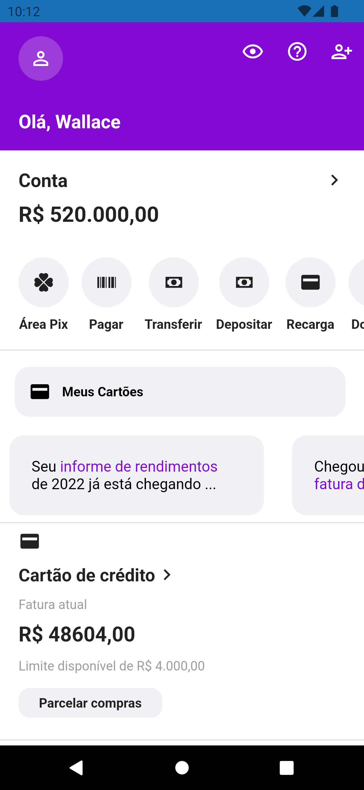
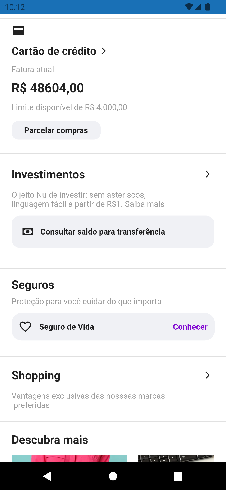
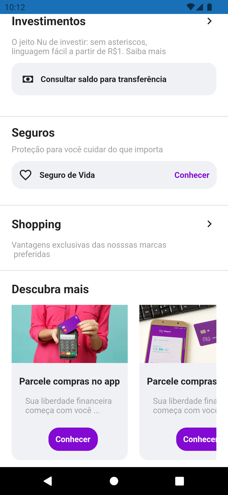

<h1 align="center">Nubank Clone</h1>
<p align="center">
  
  
  
  
</p>


# :iphone: Sobre o Projeto

<p>
  Este App se resume em um clone do App bancário Nubank
  
  A partir do App foi possível treinar a construção de telas e conhecer mais sobre os widgets
  
  O projeto foi baseado na playlist de vídeos do [Dev Outlier](https://www.youtube.com/watch?v=w5xEqhbtYPM&t=9s&ab_channel=DevOutlier)
</p>

# :camera: Screenshots
<div align="center">
   
   
   
</div>


# :rocket: Tecnologias

- [Flutter](https://flutter.dev/)
- [Dart](https://pub.dev/)
- [GetX](https://pub.dev/packages/get)
- [Github](https://github.com)


# :computer: Como rodar

```bash
# Clone Repositorio
$ git clone https://github.com/WallaceHolanda/nubank_clone.git

# Instale as dependências
$ flutter pub get

# Rode a aplicação
$ flutter run
```


# :page_facing_up: Licença

Este projeto está sob a [MIT License](./LICENSE)

Feito por Wallace Holanda
